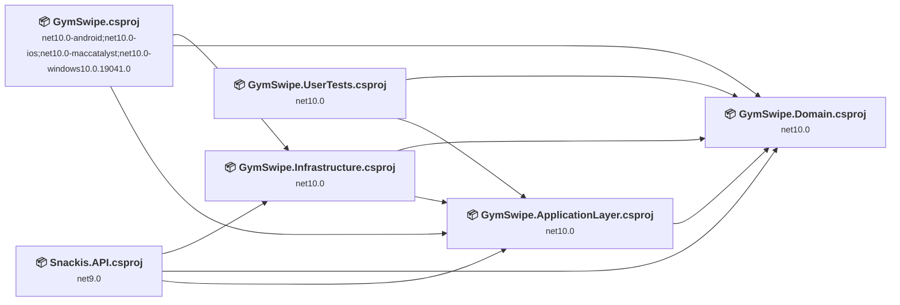
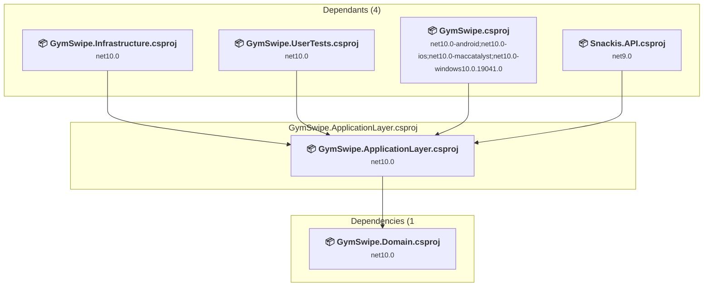
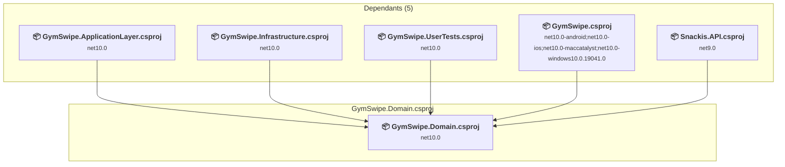
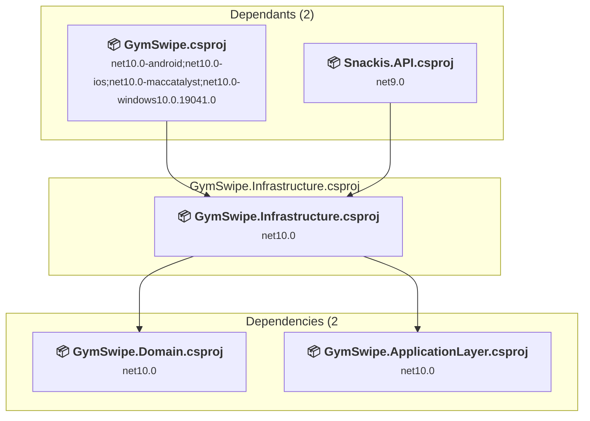
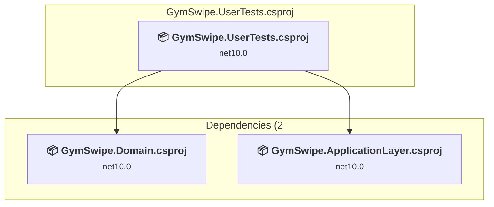
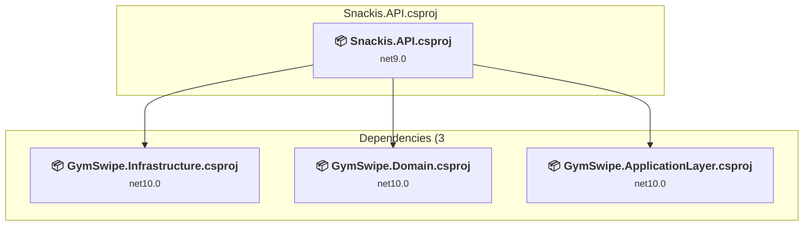
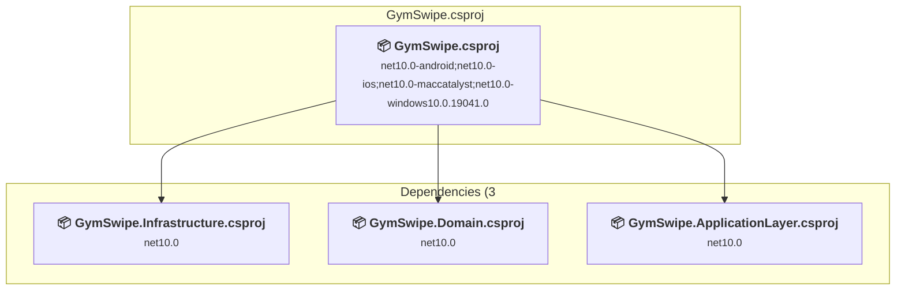

# Projects and dependencies analysis

This document provides a comprehensive overview of the projects and their dependencies in the context of upgrading to .NETCoreApp,Version=v10.0.

## Table of Contents

- [Executive Summary](#executive-Summary)
  - [Highlevel Metrics](#highlevel-metrics)
  - [Projects Compatibility](#projects-compatibility)
  - [Package Compatibility](#package-compatibility)
  - [API Compatibility](#api-compatibility)
  - [Binding Redirect Configuration](#binding-redirect-configuration)
- [Aggregate NuGet packages details](#aggregate-nuget-packages-details)
- [Top API Migration Challenges](#top-api-migration-challenges)
  - [Technologies and Features](#technologies-and-features)
  - [Most Frequent API Issues](#most-frequent-api-issues)
- [Projects Relationship Graph](#projects-relationship-graph)
- [Project Details](#project-details)

  - [C:\SystemutvecklingSamling\test\gymApp\GymSwipe.Application\GymSwipe.ApplicationLayer.csproj](#c:systemutvecklingsamlingtestgymappgymswipeapplicationgymswipeapplicationlayercsproj)
  - [C:\SystemutvecklingSamling\test\gymApp\GymSwipe.Domain\GymSwipe.Domain.csproj](#c:systemutvecklingsamlingtestgymappgymswipedomaingymswipedomaincsproj)
  - [C:\SystemutvecklingSamling\test\gymApp\GymSwipe.Infrastructure\GymSwipe.Infrastructure.csproj](#c:systemutvecklingsamlingtestgymappgymswipeinfrastructuregymswipeinfrastructurecsproj)
  - [C:\SystemutvecklingSamling\test\gymApp\GymSwipe.UserTests\GymSwipe.UserTests.csproj](#c:systemutvecklingsamlingtestgymappgymswipeusertestsgymswipeusertestscsproj)
  - [C:\SystemutvecklingSamling\test\gymApp\Snackis.API\Snackis.API.csproj](#c:systemutvecklingsamlingtestgymappsnackisapisnackisapicsproj)
  - [GymSwipe.csproj](#gymswipecsproj)

## Executive Summary

### Highlevel Metrics

| Metric | Count | Status |
| :--- | :---: | :--- |
| Total Projects | 6 | 1 require upgrade |
| Total NuGet Packages | 220 | 2 need upgrade |
| Total Code Files | 51 |  |
| Total Code Files with Incidents | 2 |  |
| Total Lines of Code | 1178 |  |
| Total Number of Issues | 4 |  |
| Estimated LOC to modify | 1+ | at least 0,1% of codebase |

### Projects Compatibility

| Project | Target Framework | Difficulty | Package Issues | API Issues | Binding Issues | Est. LOC Impact | Description |
| :--- | :---: | :---: | :---: | :---: | :---: | :---: | :--- |
| [C:\SystemutvecklingSamling\test\gymApp\GymSwipe.Application\GymSwipe.ApplicationLayer.csproj](#c:systemutvecklingsamlingtestgymappgymswipeapplicationgymswipeapplicationlayercsproj) | net10.0 | ✅ None | 0 | 0 | 0 |  | ClassLibrary, Sdk Style = True |
| [C:\SystemutvecklingSamling\test\gymApp\GymSwipe.Domain\GymSwipe.Domain.csproj](#c:systemutvecklingsamlingtestgymappgymswipedomaingymswipedomaincsproj) | net10.0 | ✅ None | 0 | 0 | 0 |  | ClassLibrary, Sdk Style = True |
| [C:\SystemutvecklingSamling\test\gymApp\GymSwipe.Infrastructure\GymSwipe.Infrastructure.csproj](#c:systemutvecklingsamlingtestgymappgymswipeinfrastructuregymswipeinfrastructurecsproj) | net10.0 | ✅ None | 0 | 0 | 0 |  | ClassLibrary, Sdk Style = True |
| [C:\SystemutvecklingSamling\test\gymApp\GymSwipe.UserTests\GymSwipe.UserTests.csproj](#c:systemutvecklingsamlingtestgymappgymswipeusertestsgymswipeusertestscsproj) | net10.0 | ✅ None | 0 | 0 | 0 |  | DotNetCoreApp, Sdk Style = True |
| [C:\SystemutvecklingSamling\test\gymApp\Snackis.API\Snackis.API.csproj](#c:systemutvecklingsamlingtestgymappsnackisapisnackisapicsproj) | net9.0 | 🟢 Low | 2 | 1 | 0 | 1+ | AspNetCore, Sdk Style = True |
| [GymSwipe.csproj](#gymswipecsproj) | net10.0-android;net10.0-ios;net10.0-maccatalyst;net10.0-windows10.0.19041.0 | ✅ None | 0 | 0 | 0 |  | ClassLibrary, Sdk Style = True |

### Package Compatibility

| Status | Count | Percentage |
| :--- | :---: | :---: |
| ✅ Compatible | 218 | 99,1% |
| ⚠️ Incompatible | 0 | 0,0% |
| 🔄 Upgrade Recommended | 2 | 0,9% |
| ***Total NuGet Packages*** | ***220*** | ***100%*** |

### API Compatibility

| Category | Count | Impact |
| :--- | :---: | :--- |
| 🔴 Binary Incompatible | 0 | High - Require code changes |
| 🟡 Source Incompatible | 0 | Medium - Needs re-compilation and potential conflicting API error fixing |
| 🔵 Behavioral change | 1 | Low - Behavioral changes that may require testing at runtime |
| ✅ Compatible | 129 |  |
| ***Total APIs Analyzed*** | ***130*** |  |

## Aggregate NuGet packages details

| Package | Current Version | Suggested Version | Projects | Description |
| :--- | :---: | :---: | :--- | :--- |
| Azure.Core | 1.50.0 |  | [GymSwipe.csproj](#gymswipecsproj) [GymSwipe.Infrastructure.csproj](#c:systemutvecklingsamlingtestgymappgymswipeinfrastructuregymswipeinfrastructurecsproj) | ✅Compatible |
| Azure.Identity | 1.17.1 |  | [GymSwipe.csproj](#gymswipecsproj) [GymSwipe.Infrastructure.csproj](#c:systemutvecklingsamlingtestgymappgymswipeinfrastructuregymswipeinfrastructurecsproj) | ✅Compatible |
| GoogleGson | 2.13.1.1 |  | [GymSwipe.csproj](#gymswipecsproj) | ✅Compatible |
| Humanizer.Core | 2.14.1 |  | [GymSwipe.Infrastructure.csproj](#c:systemutvecklingsamlingtestgymappgymswipeinfrastructuregymswipeinfrastructurecsproj) [Snackis.API.csproj](#c:systemutvecklingsamlingtestgymappsnackisapisnackisapicsproj) | ✅Compatible |
| Microsoft.AspNetCore.OpenApi | 9.0.16 | 10.0.12 | [Snackis.API.csproj](#c:systemutvecklingsamlingtestgymappsnackisapisnackisapicsproj) | NuGet package upgrade is recommended |
| Microsoft.Bcl.AsyncInterfaces | 7.0.0 |  | [Snackis.API.csproj](#c:systemutvecklingsamlingtestgymappsnackisapisnackisapicsproj) | ✅Compatible |
| Microsoft.Bcl.AsyncInterfaces | 8.0.0 |  | [GymSwipe.csproj](#gymswipecsproj) [GymSwipe.Infrastructure.csproj](#c:systemutvecklingsamlingtestgymappgymswipeinfrastructuregymswipeinfrastructurecsproj) | ✅Compatible |
| Microsoft.Build.Framework | 17.8.3 |  | [Snackis.API.csproj](#c:systemutvecklingsamlingtestgymappsnackisapisnackisapicsproj) | ✅Compatible |
| Microsoft.Build.Framework | 18.0.2 |  | [GymSwipe.Infrastructure.csproj](#c:systemutvecklingsamlingtestgymappgymswipeinfrastructuregymswipeinfrastructurecsproj) | ✅Compatible |
| Microsoft.Build.Locator | 1.7.8 |  | [Snackis.API.csproj](#c:systemutvecklingsamlingtestgymappsnackisapisnackisapicsproj) | ✅Compatible |
| Microsoft.CodeAnalysis.Analyzers | 3.11.0 |  | [GymSwipe.Infrastructure.csproj](#c:systemutvecklingsamlingtestgymappgymswipeinfrastructuregymswipeinfrastructurecsproj) | ✅Compatible |
| Microsoft.CodeAnalysis.Analyzers | 3.3.4 |  | [Snackis.API.csproj](#c:systemutvecklingsamlingtestgymappsnackisapisnackisapicsproj) | ✅Compatible |
| Microsoft.CodeAnalysis.Common | 4.8.0 |  | [Snackis.API.csproj](#c:systemutvecklingsamlingtestgymappsnackisapisnackisapicsproj) | ✅Compatible |
| Microsoft.CodeAnalysis.Common | 5.0.0 |  | [GymSwipe.Infrastructure.csproj](#c:systemutvecklingsamlingtestgymappgymswipeinfrastructuregymswipeinfrastructurecsproj) | ✅Compatible |
| Microsoft.CodeAnalysis.CSharp | 4.8.0 |  | [Snackis.API.csproj](#c:systemutvecklingsamlingtestgymappsnackisapisnackisapicsproj) | ✅Compatible |
| Microsoft.CodeAnalysis.CSharp | 5.0.0 |  | [GymSwipe.Infrastructure.csproj](#c:systemutvecklingsamlingtestgymappgymswipeinfrastructuregymswipeinfrastructurecsproj) | ✅Compatible |
| Microsoft.CodeAnalysis.CSharp.Workspaces | 4.8.0 |  | [Snackis.API.csproj](#c:systemutvecklingsamlingtestgymappsnackisapisnackisapicsproj) | ✅Compatible |
| Microsoft.CodeAnalysis.CSharp.Workspaces | 5.0.0 |  | [GymSwipe.Infrastructure.csproj](#c:systemutvecklingsamlingtestgymappgymswipeinfrastructuregymswipeinfrastructurecsproj) | ✅Compatible |
| Microsoft.CodeAnalysis.Workspaces.Common | 4.8.0 |  | [Snackis.API.csproj](#c:systemutvecklingsamlingtestgymappsnackisapisnackisapicsproj) | ✅Compatible |
| Microsoft.CodeAnalysis.Workspaces.Common | 5.0.0 |  | [GymSwipe.Infrastructure.csproj](#c:systemutvecklingsamlingtestgymappgymswipeinfrastructuregymswipeinfrastructurecsproj) | ✅Compatible |
| Microsoft.CodeAnalysis.Workspaces.MSBuild | 4.8.0 |  | [Snackis.API.csproj](#c:systemutvecklingsamlingtestgymappsnackisapisnackisapicsproj) | ✅Compatible |
| Microsoft.CodeAnalysis.Workspaces.MSBuild | 5.0.0 |  | [GymSwipe.Infrastructure.csproj](#c:systemutvecklingsamlingtestgymappgymswipeinfrastructuregymswipeinfrastructurecsproj) | ✅Compatible |
| Microsoft.CodeCoverage | 18.10.1 |  | [GymSwipe.UserTests.csproj](#c:systemutvecklingsamlingtestgymappgymswipeusertestsgymswipeusertestscsproj) | ✅Compatible |
| Microsoft.Data.SqlClient | 6.1.6 |  | [GymSwipe.csproj](#gymswipecsproj) [GymSwipe.Infrastructure.csproj](#c:systemutvecklingsamlingtestgymappgymswipeinfrastructuregymswipeinfrastructurecsproj) | ✅Compatible |
| Microsoft.Data.SqlClient.SNI.runtime | 6.0.2 |  | [GymSwipe.csproj](#gymswipecsproj) [GymSwipe.Infrastructure.csproj](#c:systemutvecklingsamlingtestgymappgymswipeinfrastructuregymswipeinfrastructurecsproj) | ✅Compatible |
| Microsoft.EntityFrameworkCore | 10.0.12 |  | [GymSwipe.csproj](#gymswipecsproj) [GymSwipe.Infrastructure.csproj](#c:systemutvecklingsamlingtestgymappgymswipeinfrastructuregymswipeinfrastructurecsproj) | ✅Compatible |
| Microsoft.EntityFrameworkCore | 9.0.0 |  | [Snackis.API.csproj](#c:systemutvecklingsamlingtestgymappsnackisapisnackisapicsproj) | ✅Compatible |
| Microsoft.EntityFrameworkCore.Abstractions | 10.0.12 |  | [GymSwipe.csproj](#gymswipecsproj) [GymSwipe.Infrastructure.csproj](#c:systemutvecklingsamlingtestgymappgymswipeinfrastructuregymswipeinfrastructurecsproj) | ✅Compatible |
| Microsoft.EntityFrameworkCore.Abstractions | 9.0.0 |  | [Snackis.API.csproj](#c:systemutvecklingsamlingtestgymappsnackisapisnackisapicsproj) | ✅Compatible |
| Microsoft.EntityFrameworkCore.Analyzers | 10.0.12 |  | [GymSwipe.csproj](#gymswipecsproj) [GymSwipe.Infrastructure.csproj](#c:systemutvecklingsamlingtestgymappgymswipeinfrastructuregymswipeinfrastructurecsproj) | ✅Compatible |
| Microsoft.EntityFrameworkCore.Analyzers | 9.0.0 |  | [Snackis.API.csproj](#c:systemutvecklingsamlingtestgymappsnackisapisnackisapicsproj) | ✅Compatible |
| Microsoft.EntityFrameworkCore.Design | 10.0.12 |  | [GymSwipe.Infrastructure.csproj](#c:systemutvecklingsamlingtestgymappgymswipeinfrastructuregymswipeinfrastructurecsproj) | ✅Compatible |
| Microsoft.EntityFrameworkCore.Design | 9.0.0 | 10.0.12 | [Snackis.API.csproj](#c:systemutvecklingsamlingtestgymappsnackisapisnackisapicsproj) | NuGet package upgrade is recommended |
| Microsoft.EntityFrameworkCore.Relational | 10.0.12 |  | [GymSwipe.csproj](#gymswipecsproj) [GymSwipe.Infrastructure.csproj](#c:systemutvecklingsamlingtestgymappgymswipeinfrastructuregymswipeinfrastructurecsproj) | ✅Compatible |
| Microsoft.EntityFrameworkCore.Relational | 9.0.0 |  | [Snackis.API.csproj](#c:systemutvecklingsamlingtestgymappsnackisapisnackisapicsproj) | ✅Compatible |
| Microsoft.EntityFrameworkCore.SqlServer | 10.0.12 |  | [GymSwipe.csproj](#gymswipecsproj) [GymSwipe.Infrastructure.csproj](#c:systemutvecklingsamlingtestgymappgymswipeinfrastructuregymswipeinfrastructurecsproj) | ✅Compatible |
| Microsoft.EntityFrameworkCore.Tools | 10.0.12 |  | [GymSwipe.Infrastructure.csproj](#c:systemutvecklingsamlingtestgymappgymswipeinfrastructuregymswipeinfrastructurecsproj) | ✅Compatible |
| Microsoft.Extensions.ApiDescription.Server | 9.0.0 |  | [Snackis.API.csproj](#c:systemutvecklingsamlingtestgymappsnackisapisnackisapicsproj) | ✅Compatible |
| Microsoft.Extensions.Caching.Abstractions | 10.0.12 |  | [GymSwipe.csproj](#gymswipecsproj) [GymSwipe.Infrastructure.csproj](#c:systemutvecklingsamlingtestgymappgymswipeinfrastructuregymswipeinfrastructurecsproj) | ✅Compatible |
| Microsoft.Extensions.Caching.Abstractions | 9.0.0 |  | [Snackis.API.csproj](#c:systemutvecklingsamlingtestgymappsnackisapisnackisapicsproj) | ✅Compatible |
| Microsoft.Extensions.Caching.Memory | 10.0.12 |  | [GymSwipe.csproj](#gymswipecsproj) [GymSwipe.Infrastructure.csproj](#c:systemutvecklingsamlingtestgymappgymswipeinfrastructuregymswipeinfrastructurecsproj) | ✅Compatible |
| Microsoft.Extensions.Caching.Memory | 9.0.0 |  | [Snackis.API.csproj](#c:systemutvecklingsamlingtestgymappsnackisapisnackisapicsproj) | ✅Compatible |
| Microsoft.Extensions.Configuration | 10.0.0 |  | [GymSwipe.csproj](#gymswipecsproj) | ✅Compatible |
| Microsoft.Extensions.Configuration.Abstractions | 10.0.12 |  | [GymSwipe.csproj](#gymswipecsproj) [GymSwipe.Infrastructure.csproj](#c:systemutvecklingsamlingtestgymappgymswipeinfrastructuregymswipeinfrastructurecsproj) | ✅Compatible |
| Microsoft.Extensions.Configuration.Abstractions | 9.0.0 |  | [Snackis.API.csproj](#c:systemutvecklingsamlingtestgymappsnackisapisnackisapicsproj) | ✅Compatible |
| Microsoft.Extensions.DependencyInjection | 10.0.12 |  | [GymSwipe.csproj](#gymswipecsproj) [GymSwipe.Infrastructure.csproj](#c:systemutvecklingsamlingtestgymappgymswipeinfrastructuregymswipeinfrastructurecsproj) | ✅Compatible |
| Microsoft.Extensions.DependencyInjection | 9.0.0 |  | [Snackis.API.csproj](#c:systemutvecklingsamlingtestgymappsnackisapisnackisapicsproj) | ✅Compatible |
| Microsoft.Extensions.DependencyInjection.Abstractions | 10.0.12 |  | [GymSwipe.csproj](#gymswipecsproj) [GymSwipe.Infrastructure.csproj](#c:systemutvecklingsamlingtestgymappgymswipeinfrastructuregymswipeinfrastructurecsproj) | ✅Compatible |
| Microsoft.Extensions.DependencyInjection.Abstractions | 9.0.0 |  | [Snackis.API.csproj](#c:systemutvecklingsamlingtestgymappsnackisapisnackisapicsproj) | ✅Compatible |
| Microsoft.Extensions.DependencyModel | 10.0.12 |  | [GymSwipe.Infrastructure.csproj](#c:systemutvecklingsamlingtestgymappgymswipeinfrastructuregymswipeinfrastructurecsproj) | ✅Compatible |
| Microsoft.Extensions.DependencyModel | 9.0.0 |  | [Snackis.API.csproj](#c:systemutvecklingsamlingtestgymappsnackisapisnackisapicsproj) | ✅Compatible |
| Microsoft.Extensions.Diagnostics.Abstractions | 10.0.0 |  | [GymSwipe.csproj](#gymswipecsproj) | ✅Compatible |
| Microsoft.Extensions.FileProviders.Abstractions | 10.0.0 |  | [GymSwipe.csproj](#gymswipecsproj) | ✅Compatible |
| Microsoft.Extensions.Hosting.Abstractions | 10.0.0 |  | [GymSwipe.csproj](#gymswipecsproj) | ✅Compatible |
| Microsoft.Extensions.Logging | 10.0.12 |  | [GymSwipe.csproj](#gymswipecsproj) [GymSwipe.Infrastructure.csproj](#c:systemutvecklingsamlingtestgymappgymswipeinfrastructuregymswipeinfrastructurecsproj) | ✅Compatible |
| Microsoft.Extensions.Logging | 9.0.0 |  | [Snackis.API.csproj](#c:systemutvecklingsamlingtestgymappsnackisapisnackisapicsproj) | ✅Compatible |
| Microsoft.Extensions.Logging.Abstractions | 10.0.12 |  | [GymSwipe.csproj](#gymswipecsproj) [GymSwipe.Infrastructure.csproj](#c:systemutvecklingsamlingtestgymappgymswipeinfrastructuregymswipeinfrastructurecsproj) | ✅Compatible |
| Microsoft.Extensions.Logging.Abstractions | 9.0.0 |  | [Snackis.API.csproj](#c:systemutvecklingsamlingtestgymappsnackisapisnackisapicsproj) | ✅Compatible |
| Microsoft.Extensions.Logging.Debug | 10.0.0 |  | [GymSwipe.csproj](#gymswipecsproj) | ✅Compatible |
| Microsoft.Extensions.Options | 10.0.12 |  | [GymSwipe.csproj](#gymswipecsproj) [GymSwipe.Infrastructure.csproj](#c:systemutvecklingsamlingtestgymappgymswipeinfrastructuregymswipeinfrastructurecsproj) | ✅Compatible |
| Microsoft.Extensions.Options | 9.0.0 |  | [Snackis.API.csproj](#c:systemutvecklingsamlingtestgymappsnackisapisnackisapicsproj) | ✅Compatible |
| Microsoft.Extensions.Primitives | 10.0.12 |  | [GymSwipe.csproj](#gymswipecsproj) [GymSwipe.Infrastructure.csproj](#c:systemutvecklingsamlingtestgymappgymswipeinfrastructuregymswipeinfrastructurecsproj) | ✅Compatible |
| Microsoft.Extensions.Primitives | 9.0.0 |  | [Snackis.API.csproj](#c:systemutvecklingsamlingtestgymappsnackisapisnackisapicsproj) | ✅Compatible |
| Microsoft.Identity.Client | 4.84.2 |  | [GymSwipe.csproj](#gymswipecsproj) [GymSwipe.Infrastructure.csproj](#c:systemutvecklingsamlingtestgymappgymswipeinfrastructuregymswipeinfrastructurecsproj) | ✅Compatible |
| Microsoft.Identity.Client.Broker | 4.84.2 |  | [GymSwipe.csproj](#gymswipecsproj) [GymSwipe.Infrastructure.csproj](#c:systemutvecklingsamlingtestgymappgymswipeinfrastructuregymswipeinfrastructurecsproj) | ✅Compatible |
| Microsoft.Identity.Client.Extensions.Msal | 4.78.0 |  | [GymSwipe.csproj](#gymswipecsproj) [GymSwipe.Infrastructure.csproj](#c:systemutvecklingsamlingtestgymappgymswipeinfrastructuregymswipeinfrastructurecsproj) | ✅Compatible |
| Microsoft.Identity.Client.NativeInterop | 0.20.6 |  | [GymSwipe.csproj](#gymswipecsproj) [GymSwipe.Infrastructure.csproj](#c:systemutvecklingsamlingtestgymappgymswipeinfrastructuregymswipeinfrastructurecsproj) | ✅Compatible |
| Microsoft.IdentityModel.Abstractions | 8.14.0 |  | [GymSwipe.csproj](#gymswipecsproj) [GymSwipe.Infrastructure.csproj](#c:systemutvecklingsamlingtestgymappgymswipeinfrastructuregymswipeinfrastructurecsproj) | ✅Compatible |
| Microsoft.IdentityModel.JsonWebTokens | 7.7.1 |  | [GymSwipe.csproj](#gymswipecsproj) [GymSwipe.Infrastructure.csproj](#c:systemutvecklingsamlingtestgymappgymswipeinfrastructuregymswipeinfrastructurecsproj) | ✅Compatible |
| Microsoft.IdentityModel.Logging | 7.7.1 |  | [GymSwipe.csproj](#gymswipecsproj) [GymSwipe.Infrastructure.csproj](#c:systemutvecklingsamlingtestgymappgymswipeinfrastructuregymswipeinfrastructurecsproj) | ✅Compatible |
| Microsoft.IdentityModel.Protocols | 7.7.1 |  | [GymSwipe.csproj](#gymswipecsproj) [GymSwipe.Infrastructure.csproj](#c:systemutvecklingsamlingtestgymappgymswipeinfrastructuregymswipeinfrastructurecsproj) | ✅Compatible |
| Microsoft.IdentityModel.Protocols.OpenIdConnect | 7.7.1 |  | [GymSwipe.csproj](#gymswipecsproj) [GymSwipe.Infrastructure.csproj](#c:systemutvecklingsamlingtestgymappgymswipeinfrastructuregymswipeinfrastructurecsproj) | ✅Compatible |
| Microsoft.IdentityModel.Tokens | 7.7.1 |  | [GymSwipe.csproj](#gymswipecsproj) [GymSwipe.Infrastructure.csproj](#c:systemutvecklingsamlingtestgymappgymswipeinfrastructuregymswipeinfrastructurecsproj) | ✅Compatible |
| Microsoft.Maui.Controls | 10.0.20 |  | [GymSwipe.csproj](#gymswipecsproj) | ✅Compatible |
| Microsoft.Maui.Controls.Build.Tasks | 10.0.20 |  | [GymSwipe.csproj](#gymswipecsproj) | ✅Compatible |
| Microsoft.Maui.Controls.Core | 10.0.20 |  | [GymSwipe.csproj](#gymswipecsproj) | ✅Compatible |
| Microsoft.Maui.Controls.Xaml | 10.0.20 |  | [GymSwipe.csproj](#gymswipecsproj) | ✅Compatible |
| Microsoft.Maui.Core | 10.0.20 |  | [GymSwipe.csproj](#gymswipecsproj) | ✅Compatible |
| Microsoft.Maui.Essentials | 10.0.20 |  | [GymSwipe.csproj](#gymswipecsproj) | ✅Compatible |
| Microsoft.Maui.Graphics | 10.0.20 |  | [GymSwipe.csproj](#gymswipecsproj) | ✅Compatible |
| Microsoft.Maui.Resizetizer | 10.0.20 |  | [GymSwipe.csproj](#gymswipecsproj) | ✅Compatible |
| Microsoft.NET.ILLink.Tasks | 10.0.12 |  | [GymSwipe.csproj](#gymswipecsproj) | ✅Compatible |
| Microsoft.NET.Test.Sdk | 18.10.1 |  | [GymSwipe.UserTests.csproj](#c:systemutvecklingsamlingtestgymappgymswipeusertestsgymswipeusertestscsproj) | ✅Compatible |
| Microsoft.OpenApi | 1.6.25 |  | [Snackis.API.csproj](#c:systemutvecklingsamlingtestgymappsnackisapisnackisapicsproj) | ✅Compatible |
| Microsoft.SqlServer.Server | 1.0.0 |  | [GymSwipe.csproj](#gymswipecsproj) [GymSwipe.Infrastructure.csproj](#c:systemutvecklingsamlingtestgymappgymswipeinfrastructuregymswipeinfrastructurecsproj) | ✅Compatible |
| Microsoft.TestPlatform.ObjectModel | 18.10.1 |  | [GymSwipe.UserTests.csproj](#c:systemutvecklingsamlingtestgymappgymswipeusertestsgymswipeusertestscsproj) | ✅Compatible |
| Microsoft.TestPlatform.TestHost | 18.10.1 |  | [GymSwipe.UserTests.csproj](#c:systemutvecklingsamlingtestgymappgymswipeusertestsgymswipeusertestscsproj) | ✅Compatible |
| Microsoft.VisualStudio.SolutionPersistence | 1.0.52 |  | [GymSwipe.Infrastructure.csproj](#c:systemutvecklingsamlingtestgymappgymswipeinfrastructuregymswipeinfrastructurecsproj) | ✅Compatible |
| Mono.TextTemplating | 3.0.0 |  | [GymSwipe.Infrastructure.csproj](#c:systemutvecklingsamlingtestgymappgymswipeinfrastructuregymswipeinfrastructurecsproj) [Snackis.API.csproj](#c:systemutvecklingsamlingtestgymappsnackisapisnackisapicsproj) | ✅Compatible |
| Newtonsoft.Json | 13.0.4 |  | [GymSwipe.Infrastructure.csproj](#c:systemutvecklingsamlingtestgymappgymswipeinfrastructuregymswipeinfrastructurecsproj) | ✅Compatible |
| Swashbuckle.AspNetCore | 9.0.6 |  | [Snackis.API.csproj](#c:systemutvecklingsamlingtestgymappsnackisapisnackisapicsproj) | ✅Compatible |
| Swashbuckle.AspNetCore.Swagger | 9.0.6 |  | [Snackis.API.csproj](#c:systemutvecklingsamlingtestgymappsnackisapisnackisapicsproj) | ✅Compatible |
| Swashbuckle.AspNetCore.SwaggerGen | 9.0.6 |  | [Snackis.API.csproj](#c:systemutvecklingsamlingtestgymappsnackisapisnackisapicsproj) | ✅Compatible |
| Swashbuckle.AspNetCore.SwaggerUI | 9.0.6 |  | [Snackis.API.csproj](#c:systemutvecklingsamlingtestgymappsnackisapisnackisapicsproj) | ✅Compatible |
| System.ClientModel | 1.8.0 |  | [GymSwipe.csproj](#gymswipecsproj) [GymSwipe.Infrastructure.csproj](#c:systemutvecklingsamlingtestgymappgymswipeinfrastructuregymswipeinfrastructurecsproj) | ✅Compatible |
| System.CodeDom | 6.0.0 |  | [GymSwipe.Infrastructure.csproj](#c:systemutvecklingsamlingtestgymappgymswipeinfrastructuregymswipeinfrastructurecsproj) [Snackis.API.csproj](#c:systemutvecklingsamlingtestgymappsnackisapisnackisapicsproj) | ✅Compatible |
| System.Collections.Immutable | 7.0.0 |  | [Snackis.API.csproj](#c:systemutvecklingsamlingtestgymappsnackisapisnackisapicsproj) | ✅Compatible |
| System.Composition | 7.0.0 |  | [Snackis.API.csproj](#c:systemutvecklingsamlingtestgymappsnackisapisnackisapicsproj) | ✅Compatible |
| System.Composition | 9.0.0 |  | [GymSwipe.Infrastructure.csproj](#c:systemutvecklingsamlingtestgymappgymswipeinfrastructuregymswipeinfrastructurecsproj) | ✅Compatible |
| System.Composition.AttributedModel | 7.0.0 |  | [Snackis.API.csproj](#c:systemutvecklingsamlingtestgymappsnackisapisnackisapicsproj) | ✅Compatible |
| System.Composition.AttributedModel | 9.0.0 |  | [GymSwipe.Infrastructure.csproj](#c:systemutvecklingsamlingtestgymappgymswipeinfrastructuregymswipeinfrastructurecsproj) | ✅Compatible |
| System.Composition.Convention | 7.0.0 |  | [Snackis.API.csproj](#c:systemutvecklingsamlingtestgymappsnackisapisnackisapicsproj) | ✅Compatible |
| System.Composition.Convention | 9.0.0 |  | [GymSwipe.Infrastructure.csproj](#c:systemutvecklingsamlingtestgymappgymswipeinfrastructuregymswipeinfrastructurecsproj) | ✅Compatible |
| System.Composition.Hosting | 7.0.0 |  | [Snackis.API.csproj](#c:systemutvecklingsamlingtestgymappsnackisapisnackisapicsproj) | ✅Compatible |
| System.Composition.Hosting | 9.0.0 |  | [GymSwipe.Infrastructure.csproj](#c:systemutvecklingsamlingtestgymappgymswipeinfrastructuregymswipeinfrastructurecsproj) | ✅Compatible |
| System.Composition.Runtime | 7.0.0 |  | [Snackis.API.csproj](#c:systemutvecklingsamlingtestgymappsnackisapisnackisapicsproj) | ✅Compatible |
| System.Composition.Runtime | 9.0.0 |  | [GymSwipe.Infrastructure.csproj](#c:systemutvecklingsamlingtestgymappgymswipeinfrastructuregymswipeinfrastructurecsproj) | ✅Compatible |
| System.Composition.TypedParts | 7.0.0 |  | [Snackis.API.csproj](#c:systemutvecklingsamlingtestgymappsnackisapisnackisapicsproj) | ✅Compatible |
| System.Composition.TypedParts | 9.0.0 |  | [GymSwipe.Infrastructure.csproj](#c:systemutvecklingsamlingtestgymappgymswipeinfrastructuregymswipeinfrastructurecsproj) | ✅Compatible |
| System.Configuration.ConfigurationManager | 9.0.11 |  | [GymSwipe.csproj](#gymswipecsproj) [GymSwipe.Infrastructure.csproj](#c:systemutvecklingsamlingtestgymappgymswipeinfrastructuregymswipeinfrastructurecsproj) | ✅Compatible |
| System.Diagnostics.EventLog | 9.0.11 |  | [GymSwipe.csproj](#gymswipecsproj) [GymSwipe.Infrastructure.csproj](#c:systemutvecklingsamlingtestgymappgymswipeinfrastructuregymswipeinfrastructurecsproj) | ✅Compatible |
| System.IdentityModel.Tokens.Jwt | 7.7.1 |  | [GymSwipe.csproj](#gymswipecsproj) [GymSwipe.Infrastructure.csproj](#c:systemutvecklingsamlingtestgymappgymswipeinfrastructuregymswipeinfrastructurecsproj) | ✅Compatible |
| System.IO.Pipelines | 7.0.0 |  | [Snackis.API.csproj](#c:systemutvecklingsamlingtestgymappsnackisapisnackisapicsproj) | ✅Compatible |
| System.Memory.Data | 8.0.1 |  | [GymSwipe.csproj](#gymswipecsproj) [GymSwipe.Infrastructure.csproj](#c:systemutvecklingsamlingtestgymappgymswipeinfrastructuregymswipeinfrastructurecsproj) | ✅Compatible |
| System.Reflection.Metadata | 7.0.0 |  | [Snackis.API.csproj](#c:systemutvecklingsamlingtestgymappsnackisapisnackisapicsproj) | ✅Compatible |
| System.Runtime.CompilerServices.Unsafe | 6.0.0 |  | [Snackis.API.csproj](#c:systemutvecklingsamlingtestgymappsnackisapisnackisapicsproj) | ✅Compatible |
| System.Security.Cryptography.Pkcs | 9.0.11 |  | [GymSwipe.csproj](#gymswipecsproj) [GymSwipe.Infrastructure.csproj](#c:systemutvecklingsamlingtestgymappgymswipeinfrastructuregymswipeinfrastructurecsproj) | ✅Compatible |
| System.Security.Cryptography.ProtectedData | 9.0.11 |  | [GymSwipe.csproj](#gymswipecsproj) [GymSwipe.Infrastructure.csproj](#c:systemutvecklingsamlingtestgymappgymswipeinfrastructuregymswipeinfrastructurecsproj) | ✅Compatible |
| System.Text.Json | 9.0.0 |  | [Snackis.API.csproj](#c:systemutvecklingsamlingtestgymappsnackisapisnackisapicsproj) | ✅Compatible |
| System.Threading.Channels | 7.0.0 |  | [Snackis.API.csproj](#c:systemutvecklingsamlingtestgymappsnackisapisnackisapicsproj) | ✅Compatible |
| Xamarin.Android.Glide | 4.16.0.14 |  | [GymSwipe.csproj](#gymswipecsproj) | ✅Compatible |
| Xamarin.Android.Glide.Annotations | 4.16.0.14 |  | [GymSwipe.csproj](#gymswipecsproj) | ✅Compatible |
| Xamarin.Android.Glide.DiskLruCache | 4.16.0.14 |  | [GymSwipe.csproj](#gymswipecsproj) | ✅Compatible |
| Xamarin.Android.Glide.GifDecoder | 4.16.0.14 |  | [GymSwipe.csproj](#gymswipecsproj) | ✅Compatible |
| Xamarin.AndroidX.Activity | 1.10.1.3 |  | [GymSwipe.csproj](#gymswipecsproj) | ✅Compatible |
| Xamarin.AndroidX.Activity.Ktx | 1.10.1.3 |  | [GymSwipe.csproj](#gymswipecsproj) | ✅Compatible |
| Xamarin.AndroidX.Annotation | 1.9.1.5 |  | [GymSwipe.csproj](#gymswipecsproj) | ✅Compatible |
| Xamarin.AndroidX.Annotation.Experimental | 1.5.1.1 |  | [GymSwipe.csproj](#gymswipecsproj) | ✅Compatible |
| Xamarin.AndroidX.Annotation.Jvm | 1.9.1.5 |  | [GymSwipe.csproj](#gymswipecsproj) | ✅Compatible |
| Xamarin.AndroidX.AppCompat | 1.7.1.1 |  | [GymSwipe.csproj](#gymswipecsproj) | ✅Compatible |
| Xamarin.AndroidX.AppCompat.AppCompatResources | 1.7.1.1 |  | [GymSwipe.csproj](#gymswipecsproj) | ✅Compatible |
| Xamarin.AndroidX.Arch.Core.Common | 2.2.0.18 |  | [GymSwipe.csproj](#gymswipecsproj) | ✅Compatible |
| Xamarin.AndroidX.Arch.Core.Runtime | 2.2.0.18 |  | [GymSwipe.csproj](#gymswipecsproj) | ✅Compatible |
| Xamarin.AndroidX.Browser | 1.8.0.11 |  | [GymSwipe.csproj](#gymswipecsproj) | ✅Compatible |
| Xamarin.AndroidX.CardView | 1.0.0.36 |  | [GymSwipe.csproj](#gymswipecsproj) | ✅Compatible |
| Xamarin.AndroidX.Collection | 1.5.0.3 |  | [GymSwipe.csproj](#gymswipecsproj) | ✅Compatible |
| Xamarin.AndroidX.Collection.Jvm | 1.5.0.3 |  | [GymSwipe.csproj](#gymswipecsproj) | ✅Compatible |
| Xamarin.AndroidX.Collection.Ktx | 1.5.0.3 |  | [GymSwipe.csproj](#gymswipecsproj) | ✅Compatible |
| Xamarin.AndroidX.Concurrent.Futures | 1.3.0.1 |  | [GymSwipe.csproj](#gymswipecsproj) | ✅Compatible |
| Xamarin.AndroidX.ConstraintLayout | 2.2.1.3 |  | [GymSwipe.csproj](#gymswipecsproj) | ✅Compatible |
| Xamarin.AndroidX.ConstraintLayout.Core | 1.1.1.3 |  | [GymSwipe.csproj](#gymswipecsproj) | ✅Compatible |
| Xamarin.AndroidX.CoordinatorLayout | 1.3.0.3 |  | [GymSwipe.csproj](#gymswipecsproj) | ✅Compatible |
| Xamarin.AndroidX.Core | 1.16.0.3 |  | [GymSwipe.csproj](#gymswipecsproj) | ✅Compatible |
| Xamarin.AndroidX.Core.Core.Ktx | 1.16.0.3 |  | [GymSwipe.csproj](#gymswipecsproj) | ✅Compatible |
| Xamarin.AndroidX.Core.ViewTree | 1.0.0.3 |  | [GymSwipe.csproj](#gymswipecsproj) | ✅Compatible |
| Xamarin.AndroidX.CursorAdapter | 1.0.0.34 |  | [GymSwipe.csproj](#gymswipecsproj) | ✅Compatible |
| Xamarin.AndroidX.CustomView | 1.2.0.1 |  | [GymSwipe.csproj](#gymswipecsproj) | ✅Compatible |
| Xamarin.AndroidX.CustomView.PoolingContainer | 1.1.0.1 |  | [GymSwipe.csproj](#gymswipecsproj) | ✅Compatible |
| Xamarin.AndroidX.DrawerLayout | 1.2.0.18 |  | [GymSwipe.csproj](#gymswipecsproj) | ✅Compatible |
| Xamarin.AndroidX.DynamicAnimation | 1.1.0.3 |  | [GymSwipe.csproj](#gymswipecsproj) | ✅Compatible |
| Xamarin.AndroidX.Emoji2 | 1.5.0.6 |  | [GymSwipe.csproj](#gymswipecsproj) | ✅Compatible |
| Xamarin.AndroidX.Emoji2.ViewsHelper | 1.5.0.6 |  | [GymSwipe.csproj](#gymswipecsproj) | ✅Compatible |
| Xamarin.AndroidX.ExifInterface | 1.4.1.1 |  | [GymSwipe.csproj](#gymswipecsproj) | ✅Compatible |
| Xamarin.AndroidX.Fragment | 1.8.8.1 |  | [GymSwipe.csproj](#gymswipecsproj) | ✅Compatible |
| Xamarin.AndroidX.Fragment.Ktx | 1.8.8.1 |  | [GymSwipe.csproj](#gymswipecsproj) | ✅Compatible |
| Xamarin.AndroidX.Interpolator | 1.0.0.34 |  | [GymSwipe.csproj](#gymswipecsproj) | ✅Compatible |
| Xamarin.AndroidX.Lifecycle.Common | 2.9.2.1 |  | [GymSwipe.csproj](#gymswipecsproj) | ✅Compatible |
| Xamarin.AndroidX.Lifecycle.Common.Jvm | 2.9.2.1 |  | [GymSwipe.csproj](#gymswipecsproj) | ✅Compatible |
| Xamarin.AndroidX.Lifecycle.LiveData | 2.9.2.1 |  | [GymSwipe.csproj](#gymswipecsproj) | ✅Compatible |
| Xamarin.AndroidX.Lifecycle.LiveData.Core | 2.9.2.1 |  | [GymSwipe.csproj](#gymswipecsproj) | ✅Compatible |
| Xamarin.AndroidX.Lifecycle.LiveData.Core.Ktx | 2.9.2.1 |  | [GymSwipe.csproj](#gymswipecsproj) | ✅Compatible |
| Xamarin.AndroidX.Lifecycle.Process | 2.9.2.1 |  | [GymSwipe.csproj](#gymswipecsproj) | ✅Compatible |
| Xamarin.AndroidX.Lifecycle.Runtime | 2.9.2.1 |  | [GymSwipe.csproj](#gymswipecsproj) | ✅Compatible |
| Xamarin.AndroidX.Lifecycle.Runtime.Android | 2.9.2.1 |  | [GymSwipe.csproj](#gymswipecsproj) | ✅Compatible |
| Xamarin.AndroidX.Lifecycle.Runtime.Ktx | 2.9.2.1 |  | [GymSwipe.csproj](#gymswipecsproj) | ✅Compatible |
| Xamarin.AndroidX.Lifecycle.Runtime.Ktx.Android | 2.9.2.1 |  | [GymSwipe.csproj](#gymswipecsproj) | ✅Compatible |
| Xamarin.AndroidX.Lifecycle.ViewModel | 2.9.2.1 |  | [GymSwipe.csproj](#gymswipecsproj) | ✅Compatible |
| Xamarin.AndroidX.Lifecycle.ViewModel.Android | 2.9.2.1 |  | [GymSwipe.csproj](#gymswipecsproj) | ✅Compatible |
| Xamarin.AndroidX.Lifecycle.ViewModel.Ktx | 2.9.2.1 |  | [GymSwipe.csproj](#gymswipecsproj) | ✅Compatible |
| Xamarin.AndroidX.Lifecycle.ViewModelSavedState | 2.9.2.1 |  | [GymSwipe.csproj](#gymswipecsproj) | ✅Compatible |
| Xamarin.AndroidX.Lifecycle.ViewModelSavedState.Android | 2.9.2.1 |  | [GymSwipe.csproj](#gymswipecsproj) | ✅Compatible |
| Xamarin.AndroidX.Loader | 1.1.0.34 |  | [GymSwipe.csproj](#gymswipecsproj) | ✅Compatible |
| Xamarin.AndroidX.Navigation.Common | 2.9.2.1 |  | [GymSwipe.csproj](#gymswipecsproj) | ✅Compatible |
| Xamarin.AndroidX.Navigation.Common.Android | 2.9.2.1 |  | [GymSwipe.csproj](#gymswipecsproj) | ✅Compatible |
| Xamarin.AndroidX.Navigation.Fragment | 2.9.2.1 |  | [GymSwipe.csproj](#gymswipecsproj) | ✅Compatible |
| Xamarin.AndroidX.Navigation.Runtime | 2.9.2.1 |  | [GymSwipe.csproj](#gymswipecsproj) | ✅Compatible |
| Xamarin.AndroidX.Navigation.Runtime.Android | 2.9.2.1 |  | [GymSwipe.csproj](#gymswipecsproj) | ✅Compatible |
| Xamarin.AndroidX.Navigation.UI | 2.9.2.1 |  | [GymSwipe.csproj](#gymswipecsproj) | ✅Compatible |
| Xamarin.AndroidX.ProfileInstaller.ProfileInstaller | 1.4.1.5 |  | [GymSwipe.csproj](#gymswipecsproj) | ✅Compatible |
| Xamarin.AndroidX.RecyclerView | 1.4.0.3 |  | [GymSwipe.csproj](#gymswipecsproj) | ✅Compatible |
| Xamarin.AndroidX.ResourceInspection.Annotation | 1.0.1.22 |  | [GymSwipe.csproj](#gymswipecsproj) | ✅Compatible |
| Xamarin.AndroidX.SavedState | 1.3.1.1 |  | [GymSwipe.csproj](#gymswipecsproj) | ✅Compatible |
| Xamarin.AndroidX.SavedState.SavedState.Android | 1.3.1.1 |  | [GymSwipe.csproj](#gymswipecsproj) | ✅Compatible |
| Xamarin.AndroidX.SavedState.SavedState.Ktx | 1.3.1.1 |  | [GymSwipe.csproj](#gymswipecsproj) | ✅Compatible |
| Xamarin.AndroidX.Security.SecurityCrypto | 1.1.0.4-alpha07 |  | [GymSwipe.csproj](#gymswipecsproj) | ✅Compatible |
| Xamarin.AndroidX.SlidingPaneLayout | 1.2.0.22 |  | [GymSwipe.csproj](#gymswipecsproj) | ✅Compatible |
| Xamarin.AndroidX.Startup.StartupRuntime | 1.2.0.5 |  | [GymSwipe.csproj](#gymswipecsproj) | ✅Compatible |
| Xamarin.AndroidX.SwipeRefreshLayout | 1.1.0.29 |  | [GymSwipe.csproj](#gymswipecsproj) | ✅Compatible |
| Xamarin.AndroidX.Tracing.Tracing | 1.3.0.1 |  | [GymSwipe.csproj](#gymswipecsproj) | ✅Compatible |
| Xamarin.AndroidX.Tracing.Tracing.Android | 1.3.0.1 |  | [GymSwipe.csproj](#gymswipecsproj) | ✅Compatible |
| Xamarin.AndroidX.Transition | 1.6.0.1 |  | [GymSwipe.csproj](#gymswipecsproj) | ✅Compatible |
| Xamarin.AndroidX.VectorDrawable | 1.2.0.8 |  | [GymSwipe.csproj](#gymswipecsproj) | ✅Compatible |
| Xamarin.AndroidX.VectorDrawable.Animated | 1.2.0.8 |  | [GymSwipe.csproj](#gymswipecsproj) | ✅Compatible |
| Xamarin.AndroidX.VersionedParcelable | 1.2.1.3 |  | [GymSwipe.csproj](#gymswipecsproj) | ✅Compatible |
| Xamarin.AndroidX.ViewPager | 1.1.0.4 |  | [GymSwipe.csproj](#gymswipecsproj) | ✅Compatible |
| Xamarin.AndroidX.ViewPager2 | 1.1.0.8 |  | [GymSwipe.csproj](#gymswipecsproj) | ✅Compatible |
| Xamarin.AndroidX.Window | 1.4.0.1 |  | [GymSwipe.csproj](#gymswipecsproj) | ✅Compatible |
| Xamarin.AndroidX.Window.WindowCore | 1.4.0.1 |  | [GymSwipe.csproj](#gymswipecsproj) | ✅Compatible |
| Xamarin.AndroidX.Window.WindowCore.Jvm | 1.4.0.1 |  | [GymSwipe.csproj](#gymswipecsproj) | ✅Compatible |
| Xamarin.Google.Android.Material | 1.12.0.5 |  | [GymSwipe.csproj](#gymswipecsproj) | ✅Compatible |
| Xamarin.Google.Code.FindBugs.JSR305 | 3.0.2.21 |  | [GymSwipe.csproj](#gymswipecsproj) | ✅Compatible |
| Xamarin.Google.Crypto.Tink.Android | 1.18.0.1 |  | [GymSwipe.csproj](#gymswipecsproj) | ✅Compatible |
| Xamarin.Google.ErrorProne.Annotations | 2.41.0.1 |  | [GymSwipe.csproj](#gymswipecsproj) | ✅Compatible |
| Xamarin.Google.Guava.ListenableFuture | 1.0.0.29 |  | [GymSwipe.csproj](#gymswipecsproj) | ✅Compatible |
| Xamarin.Jetbrains.Annotations | 26.0.2.3 |  | [GymSwipe.csproj](#gymswipecsproj) | ✅Compatible |
| Xamarin.JSpecify | 1.0.0.4 |  | [GymSwipe.csproj](#gymswipecsproj) | ✅Compatible |
| Xamarin.Kotlin.StdLib | 2.2.0.1 |  | [GymSwipe.csproj](#gymswipecsproj) | ✅Compatible |
| Xamarin.KotlinX.Coroutines.Android | 1.10.2.1 |  | [GymSwipe.csproj](#gymswipecsproj) | ✅Compatible |
| Xamarin.KotlinX.Coroutines.Core | 1.10.2.1 |  | [GymSwipe.csproj](#gymswipecsproj) | ✅Compatible |
| Xamarin.KotlinX.Coroutines.Core.Jvm | 1.10.2.1 |  | [GymSwipe.csproj](#gymswipecsproj) | ✅Compatible |
| Xamarin.KotlinX.Serialization.Core | 1.9.0.1 |  | [GymSwipe.csproj](#gymswipecsproj) | ✅Compatible |
| Xamarin.KotlinX.Serialization.Core.Jvm | 1.9.0.1 |  | [GymSwipe.csproj](#gymswipecsproj) | ✅Compatible |
| xunit | 2.9.3 |  | [GymSwipe.UserTests.csproj](#c:systemutvecklingsamlingtestgymappgymswipeusertestsgymswipeusertestscsproj) | ✅Compatible |
| xunit.abstractions | 2.0.3 |  | [GymSwipe.UserTests.csproj](#c:systemutvecklingsamlingtestgymappgymswipeusertestsgymswipeusertestscsproj) | ✅Compatible |
| xunit.analyzers | 1.18.0 |  | [GymSwipe.UserTests.csproj](#c:systemutvecklingsamlingtestgymappgymswipeusertestsgymswipeusertestscsproj) | ✅Compatible |
| xunit.assert | 2.9.3 |  | [GymSwipe.UserTests.csproj](#c:systemutvecklingsamlingtestgymappgymswipeusertestsgymswipeusertestscsproj) | ✅Compatible |
| xunit.core | 2.9.3 |  | [GymSwipe.UserTests.csproj](#c:systemutvecklingsamlingtestgymappgymswipeusertestsgymswipeusertestscsproj) | ✅Compatible |
| xunit.extensibility.core | 2.9.3 |  | [GymSwipe.UserTests.csproj](#c:systemutvecklingsamlingtestgymappgymswipeusertestsgymswipeusertestscsproj) | ✅Compatible |
| xunit.extensibility.execution | 2.9.3 |  | [GymSwipe.UserTests.csproj](#c:systemutvecklingsamlingtestgymappgymswipeusertestsgymswipeusertestscsproj) | ✅Compatible |
| xunit.runner.visualstudio | 4.0.0 |  | [GymSwipe.UserTests.csproj](#c:systemutvecklingsamlingtestgymappgymswipeusertestsgymswipeusertestscsproj) | ✅Compatible |

## Top API Migration Challenges

### Technologies and Features

| Technology | Issues | Percentage | Migration Path |
| :--- | :---: | :---: | :--- |

### Most Frequent API Issues

| API | Count | Percentage | Category |
| :--- | :---: | :---: | :--- |
| M:Microsoft.Extensions.DependencyInjection.HttpClientFactoryServiceCollectionExtensions.AddHttpClient(Microsoft.Extensions.DependencyInjection.IServiceCollection) | 1 | 100,0% | Behavioral Change |

## Projects Relationship Graph

Legend:
📦 SDK-style project
⚙️ Classic project

## Project Details

### C:\SystemutvecklingSamling\test\gymApp\GymSwipe.Application\GymSwipe.ApplicationLayer.csproj

#### Project Info

- **Current Target Framework:** net10.0✅
- **SDK-style**: True
- **Project Kind:** ClassLibrary
- **Dependencies**: 1
- **Dependants**: 4
- **Number of Files**: 18
- **Lines of Code**: 347
- **Estimated LOC to modify**: 0+ (at least 0,0% of the project)

#### Dependency Graph

Legend:
📦 SDK-style project
⚙️ Classic project

### API Compatibility

| Category | Count | Impact |
| :--- | :---: | :--- |
| 🔴 Binary Incompatible | 0 | High - Require code changes |
| 🟡 Source Incompatible | 0 | Medium - Needs re-compilation and potential conflicting API error fixing |
| 🔵 Behavioral change | 0 | Low - Behavioral changes that may require testing at runtime |
| ✅ Compatible | 0 |  |
| ***Total APIs Analyzed*** | ***0*** |  |

#### Project Package References

| Package | Type | Current Version | Suggested Version | Description |
| :--- | :---: | :---: | :---: | :--- |

### C:\SystemutvecklingSamling\test\gymApp\GymSwipe.Domain\GymSwipe.Domain.csproj

#### Project Info

- **Current Target Framework:** net10.0✅
- **SDK-style**: True
- **Project Kind:** ClassLibrary
- **Dependencies**: 0
- **Dependants**: 5
- **Number of Files**: 8
- **Lines of Code**: 213
- **Estimated LOC to modify**: 0+ (at least 0,0% of the project)

#### Dependency Graph

Legend:
📦 SDK-style project
⚙️ Classic project

### API Compatibility

| Category | Count | Impact |
| :--- | :---: | :--- |
| 🔴 Binary Incompatible | 0 | High - Require code changes |
| 🟡 Source Incompatible | 0 | Medium - Needs re-compilation and potential conflicting API error fixing |
| 🔵 Behavioral change | 0 | Low - Behavioral changes that may require testing at runtime |
| ✅ Compatible | 0 |  |
| ***Total APIs Analyzed*** | ***0*** |  |

#### Project Package References

| Package | Type | Current Version | Suggested Version | Description |
| :--- | :---: | :---: | :---: | :--- |

### C:\SystemutvecklingSamling\test\gymApp\GymSwipe.Infrastructure\GymSwipe.Infrastructure.csproj

#### Project Info

- **Current Target Framework:** net10.0✅
- **SDK-style**: True
- **Project Kind:** ClassLibrary
- **Dependencies**: 2
- **Dependants**: 2
- **Number of Files**: 2
- **Lines of Code**: 75
- **Estimated LOC to modify**: 0+ (at least 0,0% of the project)

#### Dependency Graph

Legend:
📦 SDK-style project
⚙️ Classic project

### API Compatibility

| Category | Count | Impact |
| :--- | :---: | :--- |
| 🔴 Binary Incompatible | 0 | High - Require code changes |
| 🟡 Source Incompatible | 0 | Medium - Needs re-compilation and potential conflicting API error fixing |
| 🔵 Behavioral change | 0 | Low - Behavioral changes that may require testing at runtime |
| ✅ Compatible | 0 |  |
| ***Total APIs Analyzed*** | ***0*** |  |

#### Project Package References

| Package | Type | Current Version | Suggested Version | Description |
| :--- | :---: | :---: | :---: | :--- |
| Azure.Core | 🔗*Transitive* | 1.50.0 |  | ✅Compatible |
| Azure.Identity | 🔗*Transitive* | 1.17.1 |  | ✅Compatible |
| Humanizer.Core | 🔗*Transitive* | 2.14.1 |  | ✅Compatible |
| Microsoft.Bcl.AsyncInterfaces | 🔗*Transitive* | 8.0.0 |  | ✅Compatible |
| Microsoft.Build.Framework | 🔗*Transitive* | 18.0.2 |  | ✅Compatible |
| Microsoft.CodeAnalysis.Analyzers | 🔗*Transitive* | 3.11.0 |  | ✅Compatible |
| Microsoft.CodeAnalysis.Common | 🔗*Transitive* | 5.0.0 |  | ✅Compatible |
| Microsoft.CodeAnalysis.CSharp | 🔗*Transitive* | 5.0.0 |  | ✅Compatible |
| Microsoft.CodeAnalysis.CSharp.Workspaces | 🔗*Transitive* | 5.0.0 |  | ✅Compatible |
| Microsoft.CodeAnalysis.Workspaces.Common | 🔗*Transitive* | 5.0.0 |  | ✅Compatible |
| Microsoft.CodeAnalysis.Workspaces.MSBuild | 🔗*Transitive* | 5.0.0 |  | ✅Compatible |
| Microsoft.Data.SqlClient | 🔗*Transitive* | 6.1.6 |  | ✅Compatible |
| Microsoft.Data.SqlClient.SNI.runtime | 🔗*Transitive* | 6.0.2 |  | ✅Compatible |
| Microsoft.EntityFrameworkCore | Explicit | 10.0.12 |  | ✅Compatible |
| Microsoft.EntityFrameworkCore.Abstractions | Explicit | 10.0.12 |  | ✅Compatible |
| Microsoft.EntityFrameworkCore.Analyzers | 🔗*Transitive* | 10.0.12 |  | ✅Compatible |
| Microsoft.EntityFrameworkCore.Design | Explicit | 10.0.12 |  | ✅Compatible |
| Microsoft.EntityFrameworkCore.Relational | 🔗*Transitive* | 10.0.12 |  | ✅Compatible |
| Microsoft.EntityFrameworkCore.SqlServer | Explicit | 10.0.12 |  | ✅Compatible |
| Microsoft.EntityFrameworkCore.Tools | Explicit | 10.0.12 |  | ✅Compatible |
| Microsoft.Extensions.Caching.Abstractions | 🔗*Transitive* | 10.0.12 |  | ✅Compatible |
| Microsoft.Extensions.Caching.Memory | 🔗*Transitive* | 10.0.12 |  | ✅Compatible |
| Microsoft.Extensions.Configuration.Abstractions | 🔗*Transitive* | 10.0.12 |  | ✅Compatible |
| Microsoft.Extensions.DependencyInjection | 🔗*Transitive* | 10.0.12 |  | ✅Compatible |
| Microsoft.Extensions.DependencyInjection.Abstractions | 🔗*Transitive* | 10.0.12 |  | ✅Compatible |
| Microsoft.Extensions.DependencyModel | 🔗*Transitive* | 10.0.12 |  | ✅Compatible |
| Microsoft.Extensions.Logging | 🔗*Transitive* | 10.0.12 |  | ✅Compatible |
| Microsoft.Extensions.Logging.Abstractions | 🔗*Transitive* | 10.0.12 |  | ✅Compatible |
| Microsoft.Extensions.Options | 🔗*Transitive* | 10.0.12 |  | ✅Compatible |
| Microsoft.Extensions.Primitives | 🔗*Transitive* | 10.0.12 |  | ✅Compatible |
| Microsoft.Identity.Client | 🔗*Transitive* | 4.84.2 |  | ✅Compatible |
| Microsoft.Identity.Client.Broker | 🔗*Transitive* | 4.84.2 |  | ✅Compatible |
| Microsoft.Identity.Client.Extensions.Msal | 🔗*Transitive* | 4.78.0 |  | ✅Compatible |
| Microsoft.Identity.Client.NativeInterop | 🔗*Transitive* | 0.20.6 |  | ✅Compatible |
| Microsoft.IdentityModel.Abstractions | 🔗*Transitive* | 8.14.0 |  | ✅Compatible |
| Microsoft.IdentityModel.JsonWebTokens | 🔗*Transitive* | 7.7.1 |  | ✅Compatible |
| Microsoft.IdentityModel.Logging | 🔗*Transitive* | 7.7.1 |  | ✅Compatible |
| Microsoft.IdentityModel.Protocols | 🔗*Transitive* | 7.7.1 |  | ✅Compatible |
| Microsoft.IdentityModel.Protocols.OpenIdConnect | 🔗*Transitive* | 7.7.1 |  | ✅Compatible |
| Microsoft.IdentityModel.Tokens | 🔗*Transitive* | 7.7.1 |  | ✅Compatible |
| Microsoft.SqlServer.Server | 🔗*Transitive* | 1.0.0 |  | ✅Compatible |
| Microsoft.VisualStudio.SolutionPersistence | 🔗*Transitive* | 1.0.52 |  | ✅Compatible |
| Mono.TextTemplating | 🔗*Transitive* | 3.0.0 |  | ✅Compatible |
| Newtonsoft.Json | 🔗*Transitive* | 13.0.4 |  | ✅Compatible |
| System.ClientModel | 🔗*Transitive* | 1.8.0 |  | ✅Compatible |
| System.CodeDom | 🔗*Transitive* | 6.0.0 |  | ✅Compatible |
| System.Composition | 🔗*Transitive* | 9.0.0 |  | ✅Compatible |
| System.Composition.AttributedModel | 🔗*Transitive* | 9.0.0 |  | ✅Compatible |
| System.Composition.Convention | 🔗*Transitive* | 9.0.0 |  | ✅Compatible |
| System.Composition.Hosting | 🔗*Transitive* | 9.0.0 |  | ✅Compatible |
| System.Composition.Runtime | 🔗*Transitive* | 9.0.0 |  | ✅Compatible |
| System.Composition.TypedParts | 🔗*Transitive* | 9.0.0 |  | ✅Compatible |
| System.Configuration.ConfigurationManager | 🔗*Transitive* | 9.0.11 |  | ✅Compatible |
| System.Diagnostics.EventLog | 🔗*Transitive* | 9.0.11 |  | ✅Compatible |
| System.IdentityModel.Tokens.Jwt | 🔗*Transitive* | 7.7.1 |  | ✅Compatible |
| System.Memory.Data | 🔗*Transitive* | 8.0.1 |  | ✅Compatible |
| System.Security.Cryptography.Pkcs | 🔗*Transitive* | 9.0.11 |  | ✅Compatible |
| System.Security.Cryptography.ProtectedData | 🔗*Transitive* | 9.0.11 |  | ✅Compatible |

### C:\SystemutvecklingSamling\test\gymApp\GymSwipe.UserTests\GymSwipe.UserTests.csproj

#### Project Info

- **Current Target Framework:** net10.0✅
- **SDK-style**: True
- **Project Kind:** DotNetCoreApp
- **Dependencies**: 2
- **Dependants**: 0
- **Number of Files**: 4
- **Lines of Code**: 58
- **Estimated LOC to modify**: 0+ (at least 0,0% of the project)

#### Dependency Graph

Legend:
📦 SDK-style project
⚙️ Classic project

### API Compatibility

| Category | Count | Impact |
| :--- | :---: | :--- |
| 🔴 Binary Incompatible | 0 | High - Require code changes |
| 🟡 Source Incompatible | 0 | Medium - Needs re-compilation and potential conflicting API error fixing |
| 🔵 Behavioral change | 0 | Low - Behavioral changes that may require testing at runtime |
| ✅ Compatible | 0 |  |
| ***Total APIs Analyzed*** | ***0*** |  |

#### Project Package References

| Package | Type | Current Version | Suggested Version | Description |
| :--- | :---: | :---: | :---: | :--- |
| Microsoft.CodeCoverage | 🔗*Transitive* | 18.10.1 |  | ✅Compatible |
| Microsoft.NET.Test.Sdk | Explicit | 18.10.1 |  | ✅Compatible |
| Microsoft.TestPlatform.ObjectModel | 🔗*Transitive* | 18.10.1 |  | ✅Compatible |
| Microsoft.TestPlatform.TestHost | 🔗*Transitive* | 18.10.1 |  | ✅Compatible |
| xunit | Explicit | 2.9.3 |  | ✅Compatible |
| xunit.abstractions | 🔗*Transitive* | 2.0.3 |  | ✅Compatible |
| xunit.analyzers | 🔗*Transitive* | 1.18.0 |  | ✅Compatible |
| xunit.assert | 🔗*Transitive* | 2.9.3 |  | ✅Compatible |
| xunit.core | 🔗*Transitive* | 2.9.3 |  | ✅Compatible |
| xunit.extensibility.core | 🔗*Transitive* | 2.9.3 |  | ✅Compatible |
| xunit.extensibility.execution | 🔗*Transitive* | 2.9.3 |  | ✅Compatible |
| xunit.runner.visualstudio | Explicit | 4.0.0 |  | ✅Compatible |

### C:\SystemutvecklingSamling\test\gymApp\Snackis.API\Snackis.API.csproj

#### Project Info

- **Current Target Framework:** net9.0
- **Proposed Target Framework:** net10.0
- **SDK-style**: True
- **Project Kind:** AspNetCore
- **Dependencies**: 3
- **Dependants**: 0
- **Number of Files**: 5
- **Number of Files with Incidents**: 2
- **Lines of Code**: 92
- **Estimated LOC to modify**: 1+ (at least 1,1% of the project)

#### Dependency Graph

Legend:
📦 SDK-style project
⚙️ Classic project

### API Compatibility

| Category | Count | Impact |
| :--- | :---: | :--- |
| 🔴 Binary Incompatible | 0 | High - Require code changes |
| 🟡 Source Incompatible | 0 | Medium - Needs re-compilation and potential conflicting API error fixing |
| 🔵 Behavioral change | 1 | Low - Behavioral changes that may require testing at runtime |
| ✅ Compatible | 129 |  |
| ***Total APIs Analyzed*** | ***130*** |  |

#### Project Package References

| Package | Type | Current Version | Suggested Version | Description |
| :--- | :---: | :---: | :---: | :--- |
| Humanizer.Core | 🔗*Transitive* | 2.14.1 |  | ✅Compatible |
| Microsoft.AspNetCore.OpenApi | Explicit | 9.0.16 | 10.0.12 | NuGet package upgrade is recommended |
| Microsoft.Bcl.AsyncInterfaces | 🔗*Transitive* | 7.0.0 |  | ✅Compatible |
| Microsoft.Build.Framework | 🔗*Transitive* | 17.8.3 |  | ✅Compatible |
| Microsoft.Build.Locator | 🔗*Transitive* | 1.7.8 |  | ✅Compatible |
| Microsoft.CodeAnalysis.Analyzers | 🔗*Transitive* | 3.3.4 |  | ✅Compatible |
| Microsoft.CodeAnalysis.Common | 🔗*Transitive* | 4.8.0 |  | ✅Compatible |
| Microsoft.CodeAnalysis.CSharp | 🔗*Transitive* | 4.8.0 |  | ✅Compatible |
| Microsoft.CodeAnalysis.CSharp.Workspaces | 🔗*Transitive* | 4.8.0 |  | ✅Compatible |
| Microsoft.CodeAnalysis.Workspaces.Common | 🔗*Transitive* | 4.8.0 |  | ✅Compatible |
| Microsoft.CodeAnalysis.Workspaces.MSBuild | 🔗*Transitive* | 4.8.0 |  | ✅Compatible |
| Microsoft.EntityFrameworkCore | 🔗*Transitive* | 9.0.0 |  | ✅Compatible |
| Microsoft.EntityFrameworkCore.Abstractions | 🔗*Transitive* | 9.0.0 |  | ✅Compatible |
| Microsoft.EntityFrameworkCore.Analyzers | 🔗*Transitive* | 9.0.0 |  | ✅Compatible |
| Microsoft.EntityFrameworkCore.Design | Explicit | 9.0.0 | 10.0.12 | NuGet package upgrade is recommended |
| Microsoft.EntityFrameworkCore.Relational | 🔗*Transitive* | 9.0.0 |  | ✅Compatible |
| Microsoft.Extensions.ApiDescription.Server | 🔗*Transitive* | 9.0.0 |  | ✅Compatible |
| Microsoft.Extensions.Caching.Abstractions | 🔗*Transitive* | 9.0.0 |  | ✅Compatible |
| Microsoft.Extensions.Caching.Memory | 🔗*Transitive* | 9.0.0 |  | ✅Compatible |
| Microsoft.Extensions.Configuration.Abstractions | 🔗*Transitive* | 9.0.0 |  | ✅Compatible |
| Microsoft.Extensions.DependencyInjection | 🔗*Transitive* | 9.0.0 |  | ✅Compatible |
| Microsoft.Extensions.DependencyInjection.Abstractions | 🔗*Transitive* | 9.0.0 |  | ✅Compatible |
| Microsoft.Extensions.DependencyModel | 🔗*Transitive* | 9.0.0 |  | ✅Compatible |
| Microsoft.Extensions.Logging | 🔗*Transitive* | 9.0.0 |  | ✅Compatible |
| Microsoft.Extensions.Logging.Abstractions | 🔗*Transitive* | 9.0.0 |  | ✅Compatible |
| Microsoft.Extensions.Options | 🔗*Transitive* | 9.0.0 |  | ✅Compatible |
| Microsoft.Extensions.Primitives | 🔗*Transitive* | 9.0.0 |  | ✅Compatible |
| Microsoft.OpenApi | 🔗*Transitive* | 1.6.25 |  | ✅Compatible |
| Mono.TextTemplating | 🔗*Transitive* | 3.0.0 |  | ✅Compatible |
| Swashbuckle.AspNetCore | Explicit | 9.0.6 |  | ✅Compatible |
| Swashbuckle.AspNetCore.Swagger | 🔗*Transitive* | 9.0.6 |  | ✅Compatible |
| Swashbuckle.AspNetCore.SwaggerGen | 🔗*Transitive* | 9.0.6 |  | ✅Compatible |
| Swashbuckle.AspNetCore.SwaggerUI | 🔗*Transitive* | 9.0.6 |  | ✅Compatible |
| System.CodeDom | 🔗*Transitive* | 6.0.0 |  | ✅Compatible |
| System.Collections.Immutable | 🔗*Transitive* | 7.0.0 |  | ✅Compatible |
| System.Composition | 🔗*Transitive* | 7.0.0 |  | ✅Compatible |
| System.Composition.AttributedModel | 🔗*Transitive* | 7.0.0 |  | ✅Compatible |
| System.Composition.Convention | 🔗*Transitive* | 7.0.0 |  | ✅Compatible |
| System.Composition.Hosting | 🔗*Transitive* | 7.0.0 |  | ✅Compatible |
| System.Composition.Runtime | 🔗*Transitive* | 7.0.0 |  | ✅Compatible |
| System.Composition.TypedParts | 🔗*Transitive* | 7.0.0 |  | ✅Compatible |
| System.IO.Pipelines | 🔗*Transitive* | 7.0.0 |  | ✅Compatible |
| System.Reflection.Metadata | 🔗*Transitive* | 7.0.0 |  | ✅Compatible |
| System.Runtime.CompilerServices.Unsafe | 🔗*Transitive* | 6.0.0 |  | ✅Compatible |
| System.Text.Json | 🔗*Transitive* | 9.0.0 |  | ✅Compatible |
| System.Threading.Channels | 🔗*Transitive* | 7.0.0 |  | ✅Compatible |

### GymSwipe.csproj

#### Project Info

- **Current Target Framework:** net10.0-android;net10.0-ios;net10.0-maccatalyst;net10.0-windows10.0.19041.0✅
- **SDK-style**: True
- **Project Kind:** ClassLibrary
- **Dependencies**: 3
- **Dependants**: 0
- **Number of Files**: 18
- **Lines of Code**: 393
- **Estimated LOC to modify**: 0+ (at least 0,0% of the project)

#### Dependency Graph

Legend:
📦 SDK-style project
⚙️ Classic project

### API Compatibility

| Category | Count | Impact |
| :--- | :---: | :--- |
| 🔴 Binary Incompatible | 0 | High - Require code changes |
| 🟡 Source Incompatible | 0 | Medium - Needs re-compilation and potential conflicting API error fixing |
| 🔵 Behavioral change | 0 | Low - Behavioral changes that may require testing at runtime |
| ✅ Compatible | 0 |  |
| ***Total APIs Analyzed*** | ***0*** |  |

